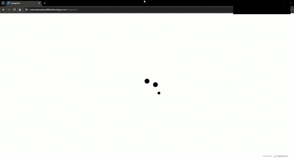

# GroupChat
Aplikasi chat grup realtime

Link Demo : [GroupChat](https://rachmadmaulana.000webhostapp.com/groupchat)

### Fitur yang ada
> - Halaman login dan registrasi
> - validasi input
> - Halaman group chat
> - Realtime chating
> - Input pesan dengan emoji
> - Responsive desktop dan mobile
> - Info user, logout, nama, teks dan waktu pengirim

### Teknologi yang digunakan
> - Bahasa : Javascript
> - Framework : ReactJS
> - Builder : ViteJS

### Paket / Modul yang digunakan
> - Bootstrap 5.3.1 (Framework CSS)
> - Iconify (Library Icon)
> - Moment (Library DateTime)
> - Bcryptjs (Library Enkripsi)
> - Firebase (Library Database)
> - SweetAlert2 (Library Alert)
> - React Loading

### Pihak Ketiga
> - Database Firestore [Firestore](https://firebase.google.com/docs/firestore)

### Cara Menggunakan
> - git clone untuk mencopy ke local storage
> - pnpm install untuk install paket / modul
> - pnpm run dev untuk menjalankan local server
> - Jalankan url yg ditampilkan lewat browser

---